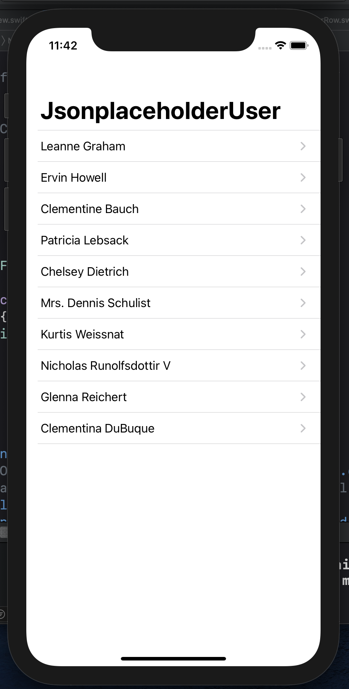
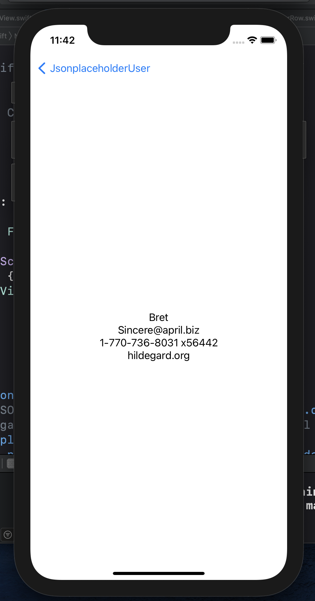

This is a SWIFTUI application that contains a list of users pulled from a https://jsonplaceholder.typicode.com/users

More detailed information of each user is seen when you click on a specific row

  
  

References:

"SwiftUI Fetch JSON Data into List"

https://www.ioscreator.com/tutorials/swiftui-json-list-tutorial

"How to add NavigationView to List in SwiftUI and show detail view using NavigationLink"

https://www.simpleswiftguide.com/how-to-add-navigationview-to-list-in-swiftui-and-show-detail-view-using-navigationlink/
