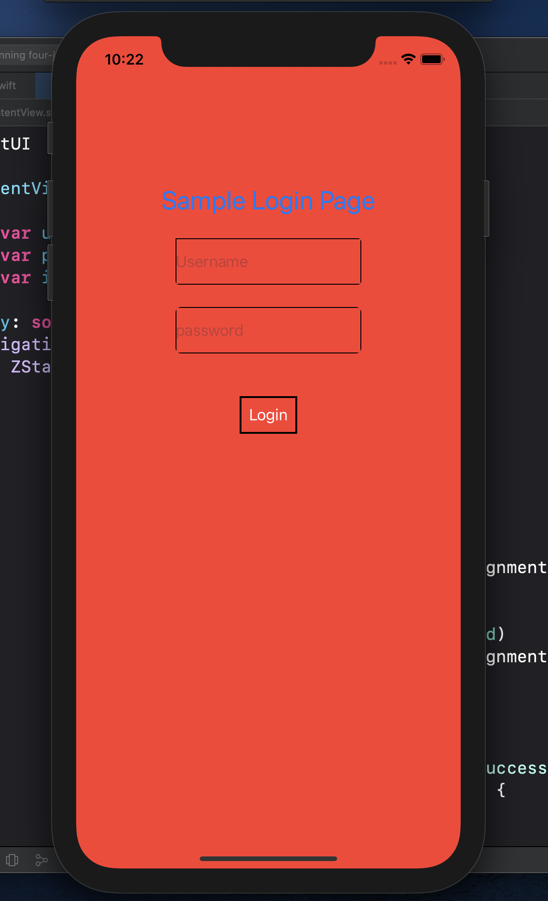
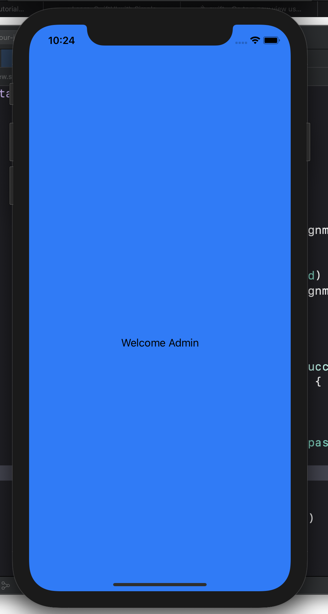

MOST UNSECURED LOGIN PAGE

This is another SWIFTUI application

  
  

The red page is the login page

If the username and password entries in the textfield matches the hardcoded credentials within the ContentView, it will navigate to the next view

Reference:

"SwiftUI Background Color Tutorial"

https://www.ioscreator.com/tutorials/swiftui-background-color-tutorial

"SwiftUI Navigation Links and the Common Pitfalls Faced"

https://medium.com/better-programming/swiftui-navigation-links-and-the-common-pitfalls-faced-505cbfd8029b
